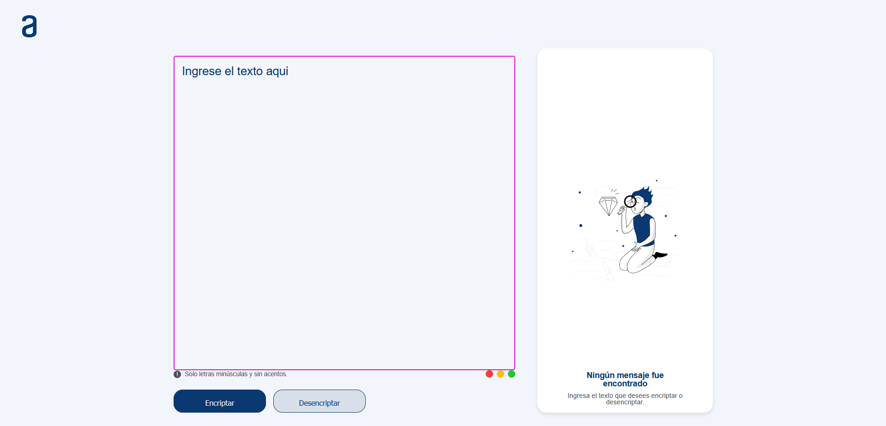

## Challenge Encriptador | Oracle + Alura

    

    
    
    

## :hammer:Como funciona

Encriptar
Al insertar su mensaje en el campo de texto y presionar el boton encriptar, la aplicacion recorrera su mensaje caracter por caracter y cambiara las vocales por codigos predeterminados.
- `1`: La letra "a" es convertida para "ai"
- `2`: La letra "e" es convertida para "enter"
- `3`: La letra "i" es convertida para "imes"
- `4`: La letra "o" es convertida para "ober"
- `5`: La letra "u" es convertida para "ufat"

Desencriptar
En ese caso, la aplicación recorrera el mensaje encriptado verificando si los caracteres coinciden con los códigos. De ser asi, la aplicación sustituirá los códigos por sus respectivas vocales.

Especificaciones
- `1`: Solo estan permitidas letras minusculas
- `2`: No estan permitidas letras con acentos ni caracteres especiales

## Autor

